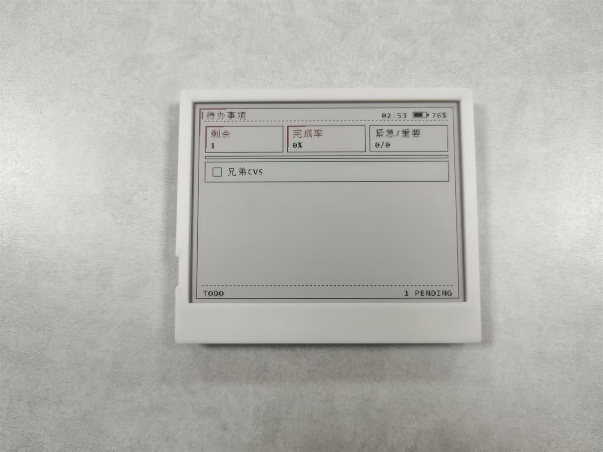
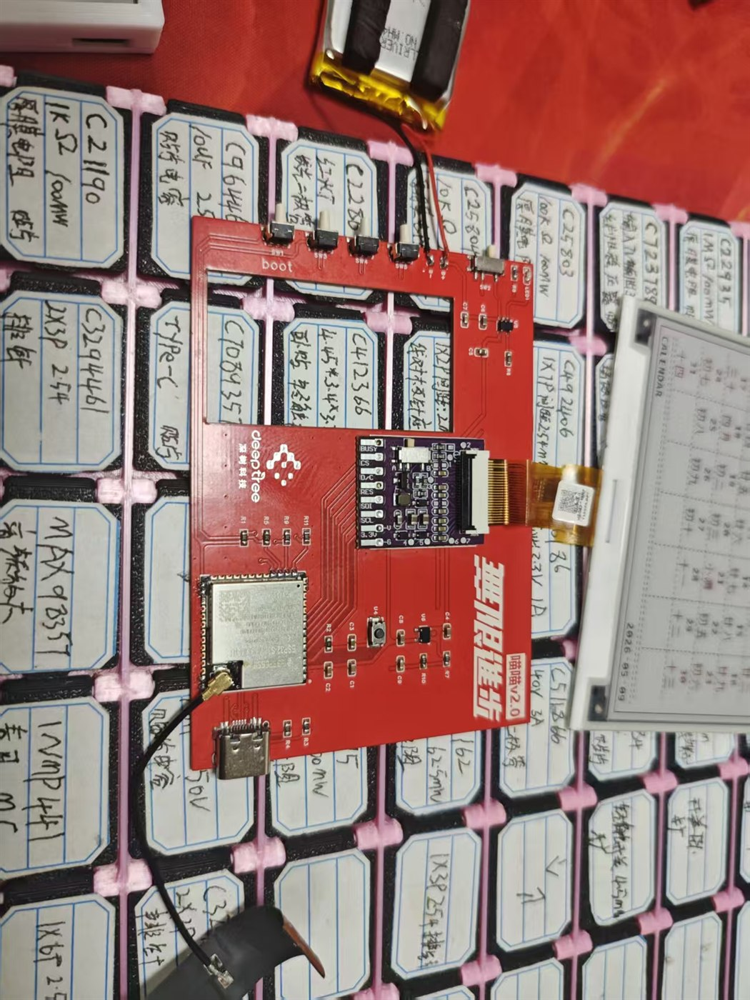
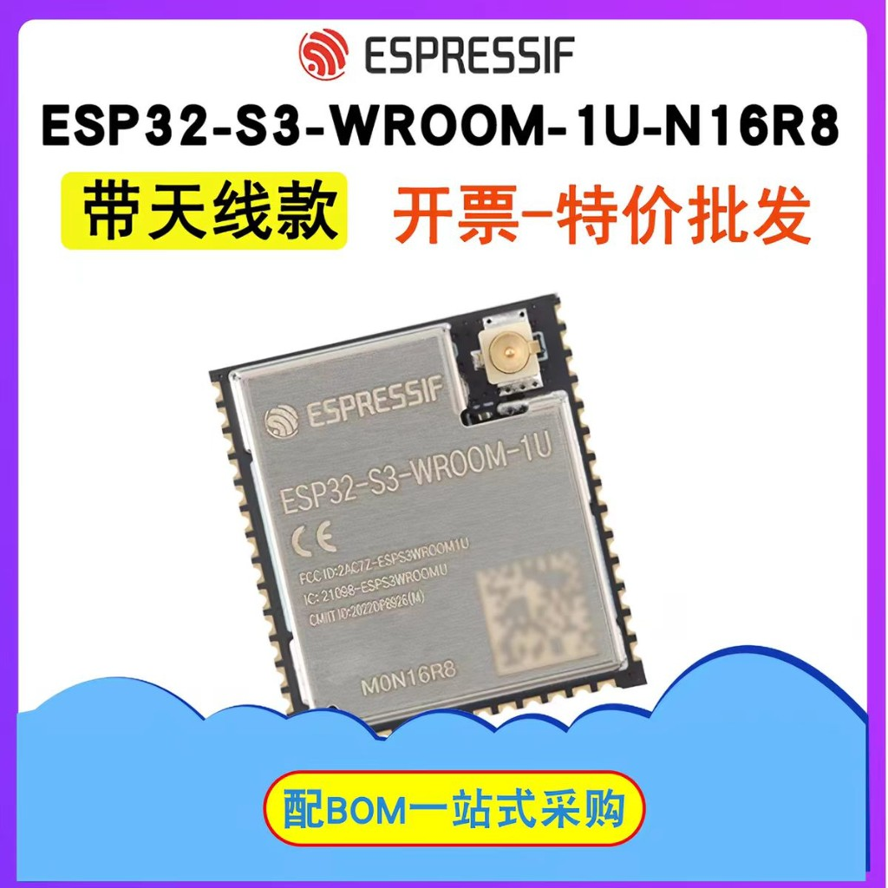
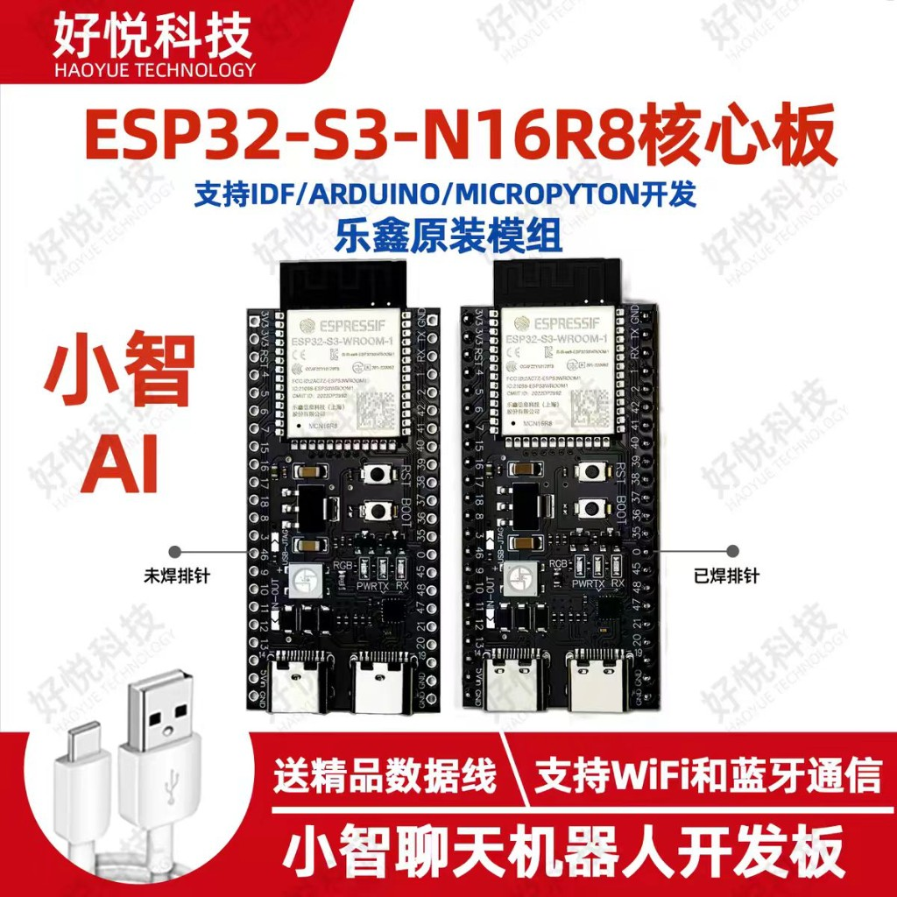
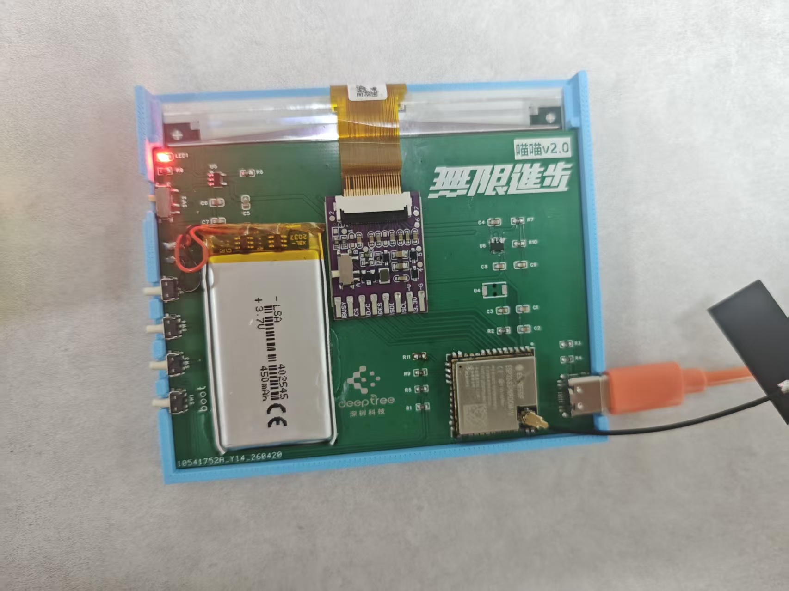
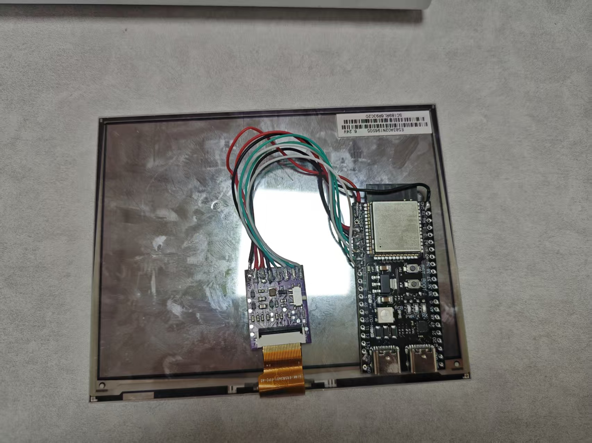
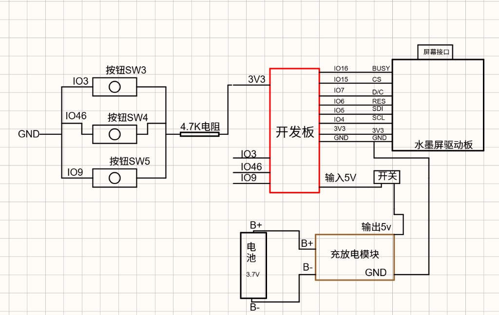

# 喵哎-MiaooAim — ESP32-S3 智能墨水屏终端

[](https://docs.espressif.com/projects/esp-idf/en/v5.5.1/)
[](LICENSE)
[](#硬件要求)
[](https://oshwhub.com/team_voosogmo/project_fxbcjhaa)

> 一款基于 ESP32-S3 的三色墨水屏智能终端固件与 Web 管理端，支持图片展示、天气、时钟、日历、课程表、待办、倒计时、留言画板、OTA 和低功耗。固件与仓库代号为 `epaper_uploader`，release 固件文件名沿用该代号。<br>
> **发布版本：v2.3.4**（与根目录 `CMakeLists.txt` 中 `PROJECT_VER` 一致；烧录后请以串口 `App version` 或 `GET /version` 的 JSON 字段 `version` 为准）。文档导航见 [文档索引.md](文档索引.md)。
> **构建环境**：**ESP-IDF 最低要求 v5.5.1**；同大版本内更高发行版（如 5.5.4）一般可直接使用，若遇兼容问题以 5.5.1 为对照。

## 一分钟了解项目

喵哎-MiaooAim 是一套面向桌面信息屏、电子相册、天气日历、课程表、待办清单和轻量状态看板的 **ESP32-S3 三色墨水屏终端固件 + Web 管理端**。仓库不是单一 Demo，而是包含固件源码、Web 前端、HTTP 接口、字库资源、分区表、测试、发布文档和 16MB 免编译烧录包的完整工程。

| 项目 | 当前状态 |
|------|----------|
| 当前版本 | v2.3.4，源码版本与 `CMakeLists.txt` 的 `PROJECT_VER` 一致 |
| 主控平台 | ESP32-S3，推荐 16MB Flash；N16 / N16R8 均可，PSRAM 可提升图片转换余量 |
| 主测屏幕 | 4.2" SSD1619 BWR 400×300、5.83" UC8179 / 微雪 BWR B V2 648×480 |
| 使用方式 | 可直接刷 release 整包，也可用 ESP-IDF v5.5.x 自行编译 |
| 管理方式 | 设备自带 AP 热点和局域网 Web 后台，支持手机或电脑配置 |
| 授权边界 | 源码公开、非商业许可；商业使用需另行取得授权 |

## 快速体验

| 目标 | 推荐入口 | 你需要做什么 |
|------|----------|--------------|
| 只想刷机使用 | [下载固件烧录包](https://gitee.com/gxp666111/miaomiao/repository/archive/firmware-download.zip) + [release/README.md](release/README.md) | 下载 ZIP，解压 `epaper_uploader_full_16MB.bin`，按 `0x0000` 烧录 |
| 第一次配置设备 | [使用说明书.md](使用说明书.md) | 连接 `ESP32_EPD_xxxxxx` 热点，打开 `http://192.168.4.1/` 配 WiFi、屏幕、天气和显示模式 |
| 想修改功能 | [ENGINEERING_DOCS.md](ENGINEERING_DOCS.md) + [IMPLEMENTATION.md](IMPLEMENTATION.md) | 安装 ESP-IDF v5.5.x，阅读启动流程、HTTP 路由、显示管线和分区说明 |
| 想复刻硬件 | [嘉立创开源硬件工程](https://oshwhub.com/team_voosogmo/project_fxbcjhaa) + [hardware/BOM.md](hardware/BOM.md) | 先确认主控、屏幕、BUSY 电平、供电和外壳结构，再烧录本仓库固件 |
| 想适配新屏幕 | [屏幕驱动支持状态](#屏幕驱动支持状态) + [IMPLEMENTATION.md](IMPLEMENTATION.md) | 先跑清屏、黑/红纯色、边框、棋盘格和文字基线，再接入业务页面 |

## 项目入口

| 入口 | 用途 |
|------|------|
| [Gitee 固件仓库](https://gitee.com/gxp666111/miaomiao) | 固件源码、Web 管理页面、文档、测试和免编译烧录包 |
| [固件下载分支](https://gitee.com/gxp666111/miaomiao/repository/archive/firmware-download.zip) | 面向普通用户的整合固件下载入口，文件名更稳定 |
| [release/README.md](release/README.md) | 免编译烧录地址、工具参数、SHA256 校验和常见问题 |
| [嘉立创开源硬件工程](https://oshwhub.com/team_voosogmo/project_fxbcjhaa) | 配套 4.2" SSD1619 PCB、外壳附件与硬件结构 |
| [文档索引.md](文档索引.md) | 所有用户文档、工程文档、发布文档和支持文档入口 |

## 当前发布状态（v2.3.4 / 2026-06-28）

当前版本已完成公开发布整理，适合复刻用户下载烧录，也适合二次开发者继续改功能、改 UI、适配屏幕。v2.3.4 在 v2.3.3 的日历、低功耗、5.83" 页面适配、字库显示、Web 画板渲染和分区文档基础上，补充 4.2" 参考驱动选项，并修复后台轮询和自动刷屏影响深睡闲置计时的问题。

### 交付物

| 类别 | 已交付内容 |
|------|------------|
| 固件源码 | `main/` 下包含启动、WiFi、HTTP、EPD、图片转换、天气、时钟、日历、课程表、待办、倒计时、画板、额度看板和低功耗模块 |
| Web 管理端 | 12 个嵌入 HTML 页面 + 1 个 PNG 品牌资源，覆盖上传、画廊、配置、天气、时钟、日历、留言、课程表、待办、倒计时、画板和额度看板 |
| HTTP 接口 | 73 条注册路由，覆盖图片、WiFi、配置、天气、课程、待办、倒计时、画板、OTA、鉴权、存储空间和系统状态 |
| 字库资源 | 内置紧凑字库 + `fontfs` 外置字库；留言/画板支持浏览器字体渲染成图片后推屏 |
| 分区表 | factory + 双 OTA + coredump + fontfs + SPIFFS，面向 16MB Flash 固件发布 |

> 首次源码编译会下载开源字体生成 `fontfs`。若日志停在 `fetch_open_fonts.py` 并提示 read timeout，通常是 GitHub 原始文件访问超时；可重试，或把 `LXGW975YuanSC-400W.ttf`、`NotoSansMono-Regular.ttf` 放入 `tools/fonts/noto/` 后重新执行 `idf.py build`。也可设置 `MIAOO_FONT_SOURCE_DIR` 指向本地开源字体缓存目录。
| 发布包 | `release/epaper_uploader_full_16MB.bin` 与 ZIP 已按 v2.3.4 当前源码重新构建并记录 SHA256 |
| 文档 | README、使用说明、工程文档、实现说明、字库说明、发布流程、安全支持、公开发布检查清单和更新日志 |

### 功能范围

| 模块 | 当前状态 | 说明 |
|------|----------|------|
| 图片上传与画廊 | 稳定可用 | 支持 JPEG / PNG / BMP，提供黑白红转换、纯黑白/线稿优化、顺序或随机轮播 |
| 时钟 | 可用 | 主时间保留独立数字风格；支持日期、星期、电量、天气摘要和分钟刷新 |
| 日历 | 可用 | 公历、农历、节气、节日、今日标记和跨日刷新；时间未同步时会降级显示 |
| 天气 | 可用 | 使用和风天气接口，支持实时天气、温度历史、天气页和带天气摘要页面；弱网时会失败降级 |
| 课程表 | 可用 | 支持学期周次、节次、当天课程、当前/下节课提示，已适配 4.2" 和 5.83" 页面 |
| 待办事项 | 可用 | 支持优先级、完成状态、网页管理和墨水屏列表展示 |
| 倒计时 | 可用 | 支持目标日期倒数、已过期/未到期状态提示和墨水屏页面展示 |
| 留言与画板 | 可用 | Web 可视化编辑，浏览器把用户选择的字体渲染成图片后推屏，减少固件内置字体占用 |
| Codex 额度看板 | 可用 | 支持中转站额度接口，展示余额、用量、请求数和令牌数 |
| OTA 与安全 | 可用 | 支持 Web OTA、Basic Auth、配置导入导出和 SPIFFS 挂载失败保护性恢复 |
| 低功耗 | 可用 | 正常开机保留 AP+STA/HTTP 后台；只有 RTC 定时唤醒进入 quick-refresh，并按当前显示模式决定是否联网 |

### 硬件验证

| 状态 | 面板/硬件 | 分辨率 | 当前结论 |
|------|-----------|--------|----------|
| 主测 | 4.2" SSD1619 BWR | 400×300 | 当前默认小屏路径，页面适配完整，默认稳定全刷 |
| 主测 | 5.83" UC8179 / 微雪 5.83" BWR B V2 | 648×480 | 当前大屏路径，已做天气、时钟、日历、待办、倒计时等页面适配，默认稳定全刷 |
| 推荐主控 | ESP32-S3 16MB Flash | - | 建议 N16 或 N16R8；PSRAM 不是必须，但有 PSRAM 时图片转换更从容 |
| 实验入口 | ATC/Solum 与 EPD-nRF5 参考面板 | 多尺寸 | 作为驱动移植入口保留，未标注主测的面板应先验证清屏、纯黑、纯红、边框、棋盘格和文字基线 |

> 兼容微雪 5.83b V2 的 648×480 黑白红屏，配置页优先选择 **微雪 5.83 寸黑白红 B V2**。如果画面尺寸正确、无镜像偏移且黑红颜色正常，边缘发虚通常优先排查屏体状态、FPC 接触、供电和温度。

### 存储与字库

| 资源 | 当前安排 |
|------|----------|
| app 分区 | factory + ota_0 + ota_1，三槽均为 3MB，支持出厂固件和 OTA 回滚空间 |
| coredump | `0x920000` 起，128KB，用于崩溃诊断 |
| fontfs | `0x940000` 起，2.875MB，放固件随附 24/32px 外置字库资源；16px 小字走内置清晰位图 |
| 用户 SPIFFS | `0xC20000` 起，3.875MB，放图片、画布素材、运行时文件和用户数据 |
| Web 字体渲染 | 留言/画板页面可调用浏览器本机字体渲染为图片后推屏，不需要把所有字体都塞进固件 |
| release 固件 | 当前 `release/` 已按 v2.3.4 重新构建并记录 SHA256；后续修改源码、分区表或字库后必须重新构建 |

### 低功耗边界

| 启动场景 | WiFi / 后台行为 |
|----------|------------------|
| 正常上电 / 复位 | 启动 AP+STA、mDNS、HTTP 后台和完整任务，便于用户继续访问 Web 管理端 |
| 按键唤醒 | 按正常交互路径处理，不作为低功耗定时刷新 |
| RTC 定时唤醒 | 进入 quick-refresh，只刷新当前模式需要的内容，完成后回到深睡 |
| RTC 唤醒 + 本地页面 | 图片、轮播、待办、倒计时、课程表等默认跳过 WiFi |
| RTC 唤醒 + 联网页面 | 天气、Codex 额度、带天气摘要或时间无效需要校时的页面会启用 STA-only WiFi |

### 公开边界

- 默认刷新策略继续采用稳定全刷，不默认启用实验局刷或快刷。
- 本仓库不提交 `build/`、`managed_components/`、`sdkconfig`、`spiffs_image/`、缓存目录、本机临时目录和外部参考工程生成物。
- 公开固件内置或随包分发的字体资源应使用可再分发开源字体；网页端临时渲染用户本机字体不等同于固件分发字体。
- 不同批次屏幕的驱动 IC、BUSY 电平、FPC 接触、供电、温度和屏体状态会影响显示效果，首次复刻应先在配置页选择面板型号并确认 BUSY 电平。
- 实验面板入口只表示已有配置和驱动参考路径，不等于所有屏幕都完成实机验证。
- 本仓库采用 PolyForm Noncommercial License，允许个人学习、研究和非商业使用；商业使用需另行取得书面授权。

## 交流群（QQ）

- 群号：**1102708081**（用手机 QQ 搜索群号加群，交流使用、复刻与固件问题）

## 项目亮点

- **三色墨水屏**：支持黑白红三色显示，图片转换包含 Floyd-Steinberg 抖色和纯黑白/线稿路径。
- **WiFi 配网**：设备可创建 AP 热点，也可连接局域网；支持 mDNS 发现和 WPA2/WPA3 自适应认证。
- **Web 管理端**：多页面管理界面，手机和电脑均可配置图片、天气、时钟、日历、课程表、待办、倒计时、画板、OTA 和低功耗。
- **低功耗策略**：正常启动保留 AP+STA/HTTP 后台；RTC 定时唤醒走 quick-refresh，按当前显示模式决定是否联网。
- **OTA 升级**：factory + 双 OTA 分区设计，支持 Web 端上传固件升级。
- **安全与稳定**：配置 Basic Auth 后，推屏、配置、数据和媒体接口统一要求授权；显示请求通过 display epoch 避免旧任务反盖新画面。
- **Codex 额度看板**：支持中转站 `/v1/usage` 额度接口，网页配置 API Key 后可在墨水屏显示余额、用量、请求数和令牌数。
- **课程表 / 待办 / 倒计时**：覆盖日常课表、任务清单、目标日期倒数等常驻信息页。
- **天气与日历**：集成和风天气、农历、节气、节日和跨日刷新。
- **留言画板**：WYSIWYG Web 可视化编辑器，支持文本、形状、图标混合排版，并可使用浏览器字体渲染后推屏。

## 功能展示

| 功能 | 说明 |
|------|------|
| 图片展示 | JPEG / PNG / BMP 上传，Floyd-Steinberg 抖色，拉伸全屏显示 |
| 画廊轮播 | 自动顺序 / 随机轮播，间隔可配置 |
| 时钟表盘 | 自动刷新，数字时钟样式，可叠加天气摘要 |
| 万年历 | 月视图 + 农历 + 节气 + 节日 + 今日红圈 |
| 天气 | 和风天气 API，实时 + 3 天预报 |
| 课程表 | 学期周次 + 7×12 网格 + 当前/下节课高亮 |
| 待办事项 | 优先级(普通/重要/紧急) + 完成状态 + 进度条 |
| 倒计时 | 最多 3 个目标日期倒数 |
| Codex 额度 | 中转站额度 API，余额/已用/今日用量/请求数/令牌数看板 |
| 留言板 | 自定义文字 / 字号 / 对齐 / 颜色 |
| 画布留言板 | 可视化 Web 编辑器，支持任意拖拽排版文本、直线、矩形、椭圆与内置/自定义图标 |
| 物理按键 | 3 键切换**上述 8 种**轮显模式（上一个 / 刷新 / 下一个）；留言板与画布**仅通过网页**编辑推屏，不参与按键循环 |
| 深度睡眠 | 闲置自动入睡 + 定时器/按键唤醒 |

下图统一使用 `docs/images/` 下的英文文件名，避免代码托管平台对中文图片路径渲染不稳定。

### Web 界面截图

| `上传面板.png` | `设备配置.png` |
| :---: | :---: |
|  |  |

| `课程表管理.png` | `待办事项.png` |
| :---: | :---: |
|  |  |

### 墨水屏实物

| `4.2寸正面-立绘.jpg` | `4.2寸背壳.jpg` |
| :---: | :---: |
|  |  |

| `4.2寸侧边按键.jpg` | `4.2寸 USB-C 侧边.jpg` |
| :---: | :---: |
|  |  |

| `4.2寸天气模式.jpg` | `4.2寸图片模式.jpg` |
| :---: | :---: |
|  |  |

| `4.2寸待办模式.jpg` | `4.2寸倒计时模式.jpg` |
| :---: | :---: |
|  |  |

| `4.2寸内部结构.jpg` |
| :---: |
|  |

## 硬件要求

主控为 **ESP32-S3**（建议 **16MB Flash**，常见 **N16** 无 PSRAM 或 **N16R8**）；主测墨水屏为 **4.2" SSD1619（400×300 BWR）** 与 **5.83" UC8179（648×480 BWR）**；电源使用低静态电流 **HE9073A** 及锂电池充放电 IC、烧录可用 **CH340** 或开发板自带 **USB** 等。固件可保存面板配置，建议**保存后重启生效**，避免热切换期间 framebuffer/raw cache 尺寸不一致。

本仓库是固件与 Web 管理端；配套硬件已开源到嘉立创开源硬件平台：[喵哎-MiaooAim 4.2寸 墨水屏 SSD1619](https://oshwhub.com/team_voosogmo/project_fxbcjhaa)。嘉立创工程提供 4.2" SSD1619 PCB、外壳附件与硬件结构，固件烧录、屏幕型号选择和引脚说明仍以本仓库 README 为准。

### 屏幕驱动支持状态

| 状态 | 面板 | 分辨率 | 颜色 | 说明 |
|------|------|--------|------|------|
| 主测 | 4.2" SSD1619 BWR | 400×300 | 黑白红 | 默认小屏路径，稳定全刷；局刷/快刷入口已移除 |
| 主测 | 5.83" UC8179 BWR | 648×480 | 黑白红 | 默认大屏路径；实测局刷不稳定，默认稳定全刷 |
| 已验证 | 微雪 5.83" BWR B V2 | 648×480 | 黑白红 | 配置页可选，真机日志已验证初始化和图片显示 |
| 实验移植 | ATC/Solum SSD1619 / UC8151 / UC 4.3 / dual SSD / UC8159 / UC8179 价签面板 | 144×200 ~ 960×672 | 黑白 / 黑白红 | 参考 atc1441/Tag_FW_nRF52811 控制器序列接入配置页；未实机验证，UC8159 使用默认 VCOM/PLL，缺少源项目外部 EEPROM 回读路径 |
| 实验参考 | EPD-nRF5 SSD1619 / UC8176 / UC8179 / UC8159 / SSD1677 / JD79668 / JD79665 | 400×300 ~ 880×528 | 黑白 / 黑白红 / 黑白红黄 | 参考 EPD-nRF5 控制器命令模型重写接入；JD79668/JD79665 图片转换会生成独立黄色平面并按 2bpp 输出，未实机验证 |

> 除已验证的微雪 5.83" BWR B V2 外，早期微雪 2.9"/2.66"/2.7"/4.26"/5.83 BW 等未验证入口已按当前维护范围移除；7.5" / 4.2" UC8176 等改为 EPD-nRF5 参考实验入口，编号从 26 开始，若 NVS 中仍保存旧面板编号，固件会回退到默认 4.2" 面板。
> 若供应商页面标注“兼容微雪 5.83b V2 / 648×480 / BWR / 24Pin”，配置页优先选择 **微雪 5.83 寸 黑白红 B V2 (648×480)**。若画面尺寸正确、无镜像偏移且黑红颜色正常，边缘发虚通常优先排查屏体状态、FPC 接触、供电和温度，而不是继续切换驱动。
> ATC/Solum 实验入口只移植屏控初始化与刷屏数据路径，不包含 nRF52811 项目的 UICR 自动识别、EPD 电源脚、BS 脚、3 线回读与外挂 EPD EEPROM 支持；请按配置页面板名手动选择。
> JD79668/JD79665 四色屏的黄色目前作用于图片上传、画廊转换和测试图案；时钟、天气、课程表等内置页面仍使用黑/红两平面 framebuffer。

以下为复刻时常用器件的**示意配图**（文件名与下图一致）；配套 PCB / 外壳见 [嘉立创开源硬件工程](https://oshwhub.com/team_voosogmo/project_fxbcjhaa)，**采购级 BOM 提要**见 [hardware/BOM.md](hardware/BOM.md)、[hardware/BOM_ACTUAL.md](hardware/BOM_ACTUAL.md)，整机原理与排障见 [ENGINEERING_DOCS.md](ENGINEERING_DOCS.md) 第三章。

### 模组与开发板

适用于贴片/SMT 或自制载板：**ESP32-S3-WROOM-1U-N16R8**（**1U** = IPEX 外接天线；**N16R8** = 16MB Flash + 8MB PSRAM）。固件**不依赖 PSRAM**，同系列 **N16**（无 R8）亦可，但须满足默认分区对 **16MB Flash** 的要求。

| `模组-ESP32-S3-WROOM-1U-N16R8.png` |
| :---: |
|  |

**开发板（核心板）**

飞线原型、对照 GPIO 丝印时，可使用市售 **ESP32-S3-N16R8 核心板**（示意图见下；具体品牌以实物为准，**请对照本页引脚表**接线）。

| `开发板-ESP32-S3-N16R8核心板.png` |
| :---: |
|  |

### 整机结构与接线

磁吸一体板与 DevKit 飞线等**整机内部布置**：

| 内部结构 | 内部结构 |
| :---: | :---: |
|  |  |

> **所有已接入面板共用同一组 GPIO 接线**（见下表）。通过 Web 页面或 `POST /panel_config` 修改 `panel` 字段后，建议重启设备让面板尺寸、预留 framebuffer 与 `/spiffs/image.bin` 重新按新屏幕初始化；无需改线，也不需要修改 `main/epd_stub.c` 的引脚宏。

**硬件架构与自定义 PCB**

自定义 PCB 采用针对 Deep Sleep 优化的电源路径：
1. **锂电池直驱**：使用 **TP4054** 线性充电 IC 进行锂电池充放电管理。
2. **极低待机能耗**：摒弃传统开发板常见的高静态电流稳压器（如 AMS1117），改用 **HE9073A33M5R** 微安级 LDO 提供 3.3V 系统电源，整机深睡电流可低至 15μA。
3. **电量监控**：硬件带有 1:2 分压电阻网络，通过 ADC 接口（BAT_DET）采样电池电量。

如果你没有打样 PCB，也可以使用普通的 ESP32-S3 开发板进行面包板跳线测试。

**开发板基础接线图 (面包板测试用)**

基础整机示意：**3.7V 电池 → 充放电模块 → 开关 → 开发板 5V 输入**；**水墨屏驱动板**经 SCL/SDI/RES、D/C、CS、BUSY 与 **3V3/GND** 接至开发板对应 IO；**SW3/SW4/SW5** 分别接 **IO9 / IO46 / IO3**，及 **GND** 与下图一致（与下表核对）。



**引脚连接**

| 功能 | GPIO | 连接到 |
|------|------|--------|
| EPD SCK | **4** | 墨水屏 SCL |
| EPD MOSI | **5** | 墨水屏 SDI |
| EPD DC | **7** | 墨水屏 D/C |
| EPD CS | **15** | 墨水屏 CS |
| EPD RST | **6** | 墨水屏 RES |
| EPD BUSY | **16** | 墨水屏 BUSY |
| 按键 SW3 | **9** | 上一个模式 |
| 按键 SW4 | **46** | 刷新当前 |
| 按键 SW5 | **3** | 下一个模式 |

> BUSY 引脚需上拉，不同屏幕 BUSY 极性可能不同，固件支持 NVS 配置。

## 快速开始

### 1. 环境准备

**ESP-IDF 最低要求 v5.5.1。** 请安装 v5.5.1 或更新的 **5.5.x** 工具链（[官方指南以 5.5.1 为基准](https://docs.espressif.com/projects/esp-idf/en/v5.5.1/esp32s3/get-started/)）：

```powershell
# Windows: 下载 ESP-IDF Tools Installer

# https://dl.espressif.com/dl/esp-idf/?id=Windows

```

### 2. 克隆项目

```bash
git clone https://gitee.com/gxp666111/miaomiao.git
cd miaomiao   # 或你本地的 msp 目录名
```

### 3. 免编译一键烧录

如果只是想把固件烧进设备，无需安装 ESP-IDF，也无需自行编译。仓库已提供整包固件。

**推荐下载：** [下载固件烧录包（文件名正常）](https://gitee.com/gxp666111/miaomiao/repository/archive/firmware-download.zip)

下载后先解压，使用里面的 `epaper_uploader_full_16MB.bin` 烧录。这个下载入口使用 Gitee 的仓库打包功能，不走 raw 单文件下载，文件名不会出现单引号。

主仓库内固件路径为：

```text
release/epaper_uploader_full_16MB.bin
```

备用入口：[查看 release 固件目录](https://gitee.com/gxp666111/miaomiao/tree/master/release)。如果你手动点 raw 下载，Gitee 可能把文件名保存成 `'epaper_uploader_full_16MB.bin'`、`epaper_uploader_full_16MB.bin'` 或类似带单引号的名字；这不是文件损坏，手动重命名为 `epaper_uploader_full_16MB.bin` 即可。

在 Espressif Flash Download Tool 的 `SPIDownload` 页面只填一行：

```text
File:    release\epaper_uploader_full_16MB.bin
Address: 0x0000
```

推荐参数：

```text
SPI SPEED: 80MHz
SPI MODE:  DIO
FLASH SIZE: 16MB
DoNotChgBin: 勾选
BAUD: 115200 或 460800
```

新板子或配置混乱时可以先点 `ERASE`，再点 `START`；如果不想清空 WiFi、天气、面板等已有配置，不要点 `ERASE`，直接 `START`。更详细的免编译烧录说明见 [release/README.md](release/README.md)。

### 4. 开发者编译与烧录

本项目目标芯片固定为 **ESP32-S3**。仓库已在 `CMakeLists.txt` 和 `.vscode/settings.json` 中写入默认目标；如果你是从 Gitee 源码 ZIP 解压后首次用 VSCode 打开，建议先执行一次“干净配置”，避免旧目录残留的 `build/CMakeCache.txt`、`sdkconfig` 或 VSCode 缓存继续按普通 ESP32 编译。

```powershell
# 首次配置目标芯片，只需要执行一次

idf.py set-target esp32s3

# 编译、烧录并打开串口日志

idf.py -p COM3 build flash monitor
```

> 将 `COM3` 替换为你电脑上的实际串口号。日常升级和新芯片首次烧录都使用这条命令，不需要先执行 `erase-flash`。

如果你是从 Gitee 下载 ZIP 后直接编译，或之前在同一目录生成过 `esp32` 的 `sdkconfig`，请先清理并重新设置目标：

```powershell
idf.py fullclean
Remove-Item -Recurse -Force build -ErrorAction SilentlyContinue
idf.py set-target esp32s3
idf.py -p COM3 build flash monitor
```

典型错误特征是日志出现 `Building ESP-IDF components for target esp32`、`GPIO_NUM_46 undeclared` 或 `hal/usb_serial_jtag_ll.h: No such file or directory`。这些都表示当前按普通 ESP32 编译了本 ESP32-S3 固件。

> 不建议把新下载的源码 ZIP 直接覆盖到旧工程目录；如果覆盖后 VSCode 仍然报错，删掉 `build/` 后重新 `idf.py set-target esp32s3` 即可。更稳的方式是用 `git clone` 获取源码。

### 5. 关于 erase-flash

```powershell
# 仅在 Flash 内容混乱、分区表切换或需要完全恢复出厂状态时使用

idf.py -p COM3 erase-flash

# 擦除后重新烧录

idf.py -p COM3 build flash monitor
```

> 注意：`erase-flash` 会清空整颗 Flash，包括 WiFi 配置、NVS 设置、SPIFFS 里的图片和布局。新芯片本来就是空的，不需要先擦除。若擦除后首次启动提示 SPIFFS 未挂载，请连接设备热点进入网页恢复/格式化文件系统。

### 6. 首次使用

1. 设备上电后自动创建 WiFi 热点 `ESP32_EPD_xxxxxx`（默认密码 `12345678`）
2. 手机连接该热点，浏览器打开 `http://192.168.4.1/`
3. 进入「设备配置」→ 连接家庭 WiFi
4. 连接后通过 `http://epdxxxx.local/` 或 STA IP 访问

> 屏幕不亮或面板型号配置错误时，也可以直接连接热点 `ESP32_EPD_xxxxxx`，默认密码为 `12345678`。进入网页后到 `/config` 修改面板型号并重启。

## 项目结构

```
msp/
├── main/                        # 固件源码（C 模块，含 HTTP / EPD / 业务）
│   ├── CMakeLists.txt           # 组件注册、源文件列表、EMBED_FILES
│   ├── idf_component.yml        # ESP-IDF 组件依赖与版本约束
│   ├── app_main.c               # 启动流程（双启动路径：正常/深睡快速刷新）
│   ├── epd_stub.c / epd.h       # EPD 驱动（SSD1619 / UC8179 / ATC-Solum / EPD-nRF5 参考面板，SPI DMA）
│   ├── image_convert.c/h        # 图片解码 + Floyd-Steinberg 抖色
│   ├── http_app.c/h             # HTTP 服务（73 条 URI + Basic Auth + OTA）
│   ├── http_gallery.c           # 画廊相关路由
│   ├── http_features.c          # 功能模块路由
│   ├── http_internal.h          # HTTP 子模块共享声明
│   ├── wifi_manager.c/h         # WiFi AP/STA + 配网 + 自动重连
│   ├── scheduler.c/h            # 画廊轮播调度
│   ├── weather.c/h              # 和风天气 HTTPS
│   ├── weather_icons_qw.c/h     # 和风天气离线 1-bit 图标库
│   ├── clock_display.c/h        # 时钟表盘
│   ├── calendar_display.c/h     # 万年历 + 农历
│   ├── lunar.c/h                # 农历算法（1900-2100）
│   ├── timetable.c/h            # 课程表（7×12 网格 + 学期周次）
│   ├── todo.c/h                 # 待办事项（优先级 + 进度条）
│   ├── countdown.c/h            # 倒计时
│   ├── codex_quota.c/h          # Codex / 中转站额度看板
│   ├── message_board.c/h        # 留言板
│   ├── canvas_board.c/h         # WYSIWYG 画布留言板
│   ├── http_canvas.c            # 画布 Web 编辑器路由与图标管理
│   ├── canvas_icons.h           # 内置 1-bit 画布图标库
│   ├── button.c/h               # 三键驱动（轮询 + 去抖）
│   ├── battery_mon.c/h          # 电池电压检测与百分比估算
│   ├── fb_render.c/h            # 帧缓冲渲染引擎
│   ├── font_data.h              # 点阵字库（ASCII + 中文）
│   ├── ui_theme.c/h             # 墨水屏页面通用 UI 主题组件
│   ├── display_policy.c/h       # 显示策略协调
│   ├── display_mode.c/h         # 显示模式注册与切换
│   ├── power_mgr.c/h            # 深度睡眠与电源管理
│   ├── time_sync.c/h            # SNTP 时间同步
│   ├── device_identity.c/h      # 设备标识（MAC → AP SSID / mDNS）
│   ├── nvs_utils.c/h            # NVS 工具函数
│   ├── spiffs_mount.c/h         # SPIFFS 挂载 + 健康检查（挂载失败不自动格式化用户数据）
│   └── lodepng.c/h              # LodePNG 第三方 PNG 解码库
├── web/                         # Web UI（构建时嵌入固件）
│   ├── index.html               # 主页：上传 / 画廊 / 状态
│   ├── config.html              # 配置：WiFi / 轮播 / 天气 / OTA / 低功耗
│   ├── gallery.html             # 画廊与图片上传
│   ├── weather.html             # 天气配置与手动显示
│   ├── clock.html               # 时钟配置
│   ├── calendar.html            # 日历手动显示
│   ├── message.html             # 留言板
│   ├── codex.html               # Codex / 中转站额度看板配置
│   ├── timetable.html           # 课程表编辑
│   ├── todo.html                # 待办事项管理
│   ├── countdown.html           # 倒计时配置
│   ├── board.html               # 画布留言板可视化编辑器
│   └── miaooaim-mark.png        # Web 品牌图标资源
├── tools/                       # 辅助脚本
│   ├── fetch_open_fonts.py       # 开源字体获取辅助脚本
│   ├── gen_font.py              # 点阵字库生成工具
│   ├── gen_ext_font.py          # 外置 MEF 字库生成工具
│   ├── preview_ext_font.py      # 外置字库预览/检查工具
│   ├── gen_city_excel.py        # 和风天气城市码导出
│   ├── check_public_docs.py     # 公开文档/发布口径一致性检查
│   ├── font_extra_chars.txt     # 字库补字清单
│   ├── unifont.hex.gz           # 字库生成输入
│   └── update_gitee_about.ps1   # Gitee 仓库简介同步脚本
├── hardware/                    # 硬件提要与固件兼容性说明
│   ├── 开发板接线图.png           # 开发板 / 屏 / 按键 / 电源接线示意
│   ├── BOM_ACTUAL.md            # 与固件兼容性提要
│   └── BOM.md                   # 与固件兼容性提要
├── docs/                        # Gitee 简介、字库说明与 README 使用的硬件、实物、Web 截图
│   ├── gitee-about.md           # Gitee 仓库简介建议
│   ├── fonts.md                 # 字库来源、授权和生成说明
│   └── images/                  # README 使用图片
├── release/                     # 免编译烧录包与烧录说明
│   ├── README.md
│   ├── epaper_uploader_full_16MB.bin
│   └── epaper_uploader_full_16MB.zip
├── test/                        # 主机端单元测试
│   ├── README.md
│   └── lunar/                   # 农历/节气算法测试工程
├── .gitee/                      # Gitee Issue / PR 模板
├── .vscode/                     # VSCode ESP-IDF 默认目标配置
├── partitions.csv               # 分区表（3MB app 三槽 + coredump + fontfs + 用户 SPIFFS）
├── sdkconfig.defaults           # 项目默认配置
├── timetable_example.json       # 课程表示例配置
├── CHANGELOG.md                 # 版本更新记录
├── RELEASE.md                   # 发布流程与固件整包生成说明
├── NOTICE.md                    # 第三方组件、字体和素材声明
├── LICENSE / COMMERCIAL_LICENSE.md
├── 公开发布检查清单.md
├── SECURITY.md
├── SUPPORT.md
├── v2.3.4优化改动说明.md
├── v2.3.3优化改动说明.md
└── CMakeLists.txt               # 顶层构建脚本
```

## 分区表

| 分区 | 类型 | 大小 | 说明 |
|------|------|------|------|
| nvs | data | 48 KB | 非易失性配置存储（PHY 校准 + 各模块 blob） |
| otadata | data | 8 KB | OTA 状态 |
| phy_init | data | 4 KB | PHY 初始化基线数据 |
| factory | app | 3 MB | 出厂固件槽，保留回滚/救援入口 |
| ota_0 / ota_1 | app | 各 3 MB | OTA 双分区，具体 app 余量以发布前 `idf.py build` 的 size 输出为准 |
| coredump | data | 128 KB | panic / watchdog 崩溃转储，便于售后排障 |
| fontfs | data | 2.875 MB | 24/32px 外置字库资源分区，16px 小字保留在 app 内置位图 |
| spiffs | data | 3.875 MB | 用户图片、画布素材和运行时文件 |

> 当前分区表面向 16MB Flash。`spiffs` 用户文件区固定在 `0xC20000`，用于尽量保护已有图库/配置；`fontfs` 位于 `0x940000`。分区表或字库分区变更后，不能只 OTA app，需要同时更新 `partition_table` 和 `fontfs.bin`，出厂包建议使用完整 16MB 固件。

## Web API 概览

设备提供 **73 条 HTTP 路由**（方法+路径组合，以 `http_app.c` 注册表为准），主要分类：

| 分类 | 路径 | 说明 |
|------|------|------|
| 页面 | `/`, `/config`, `/gallery`, `/weather`, `/clock`, `/calendar`, `/message`, `/codex`, `/timetable`, `/todo`, `/countdown`, `/board` | Web UI 页面 |
| 图片 | `/upload`, `/images`, `/image`, `/show`, `/delete` | 画廊管理 |
| WiFi | `/wifi_status`, `/scan`, `/wifi_connect`, `/wifi_forget` | 网络配置 |
| 屏幕 | `/panel_config` | 屏幕型号切换 |
| 天气 | `/weather_config`, `/weather_show` | 天气配置与显示 |
| 课程表 | `/timetable.json`, `/timetable`, `/timetable_show` | 课程表管理 |
| 待办 | `/todo.json`, `/todo`, `/todo_show` | 待办事项管理 |
| 倒计时 | `/countdown_config`, `/countdown_show` | 倒计时管理 |
| Codex 额度 | `/codex_quota_config`, `/codex_quota_show` | 中转站额度配置与显示 |
| 画布留言板 | `/board`, `/canvas_layout`, `/canvas_show`, `/canvas_icon_upload`, `/canvas_image_upload` | WYSIWYG 画板、内置图标和自定义图片素材管理 |
| 系统 | `/status`, `/version`, `/epd_test`, `/font_test`, `/epd_repair`, `/spiffs_remount`, `/spiffs_format`, `/ota`, `/auth_config`, `/power_config` | 系统状态、显示测试、文件系统恢复、OTA、鉴权和低功耗配置 |

> 完整 API 文档见 [ENGINEERING_DOCS.md](ENGINEERING_DOCS.md) 的“六、API 接口文档”；完整路由以 `main/http_app.c` 注册表为准。

## 低功耗模式

| 模式 | 电流 | 唤醒源 | 说明 |
|------|------|--------|------|
| 活跃 | 150-300mA | 按键/HTTP | 正常工作 |
| 深度睡眠 | 需实测 | RTC 定时器 / GPIO | 续航按电池容量、深睡电流、唤醒间隔和联网时长估算 |

**双启动路径设计**（深度睡眠开启且本次为 **RTC 定时器** 唤醒时）：
- **完整启动**（上电 / 复位 / **按键 GPIO3·9 唤醒** 等）：AP+STA、mDNS、`http_app`、按键任务、欢迎屏流程；**可通过网页访问**。低功耗开关打开时，正常后台仍在线，只把 WiFi 省电策略切到 `MIN_MODEM`；关闭低功耗时使用 `WIFI_PS_NONE`，优先保证网页和网络速度。
- **定时器唤醒**：进入 quick-refresh，只刷新 `NVS` 中记忆的模式画面后回睡；图片/轮播/本地待办/本地倒计时/课程表等默认跳过 WiFi，天气、Codex、带天气摘要或时间无效需要校时的页面才启动 STA-only WiFi；**不启动 HTTP / 不配 SoftAP**，无法在此阶段打开网页。

**HTTP Basic Auth**：可在配置页启用。启用后敏感操作需带 `Authorization`；各 `web/*.html` 在配置页保存认证后使用 `localStorage`（`epd_auth_u` / `epd_auth_p`）自动附带请求头。配置导出/导入不会包含认证密码，恢复备份后请在配置页单独设置管理账号。详见 [ENGINEERING_DOCS.md](ENGINEERING_DOCS.md) §4.5。

## 文档导航

| 文档 | 说明 | 适用人群 |
|------|------|---------|
| [文档索引.md](文档索引.md) | 全部文档导航与按角色检索 | 所有人 |
| [ENGINEERING_DOCS.md](ENGINEERING_DOCS.md) | 工程技术文档（架构/API/模块）⭐ | 开发者 |
| [IMPLEMENTATION.md](IMPLEMENTATION.md) | 技术实现详解（算法/驱动） | 核心开发者 |
| [ROADMAP.md](ROADMAP.md) | 当前维护路线图、发布边界和后续优先级 | 贡献者 |
| [CHANGELOG.md](CHANGELOG.md) | 版本更新记录 | 用户 / 维护者 |
| [RELEASE.md](RELEASE.md) | 维护者发布流程、整包合并、校验和分支同步 | 维护者 |
| [docs/fonts.md](docs/fonts.md) | 字库来源、授权、生成和应用范围 | 二次开发者 |
| [公开发布检查清单.md](公开发布检查清单.md) | 公开发布检查清单、release 校验和剩余验证建议 | 维护者 / 复刻者 |
| [v2.3.4优化改动说明.md](v2.3.4优化改动说明.md) | v2.3.4 正式改动说明 | 用户 / 开发者 |
| [v2.3.3优化改动说明.md](v2.3.3优化改动说明.md) | v2.3.3 历史版本说明 | 用户 / 开发者 |
| [CONTRIBUTING.md](CONTRIBUTING.md) | Issue / PR / 屏幕适配贡献规范 | 贡献者 |
| [CODE_OF_CONDUCT.md](CODE_OF_CONDUCT.md) | 社区行为规范、日志脱敏和协作边界 | 所有参与者 |
| [SECURITY.md](SECURITY.md) | 安全边界、漏洞报告和密钥脱敏建议 | 用户 / 维护者 |
| [SUPPORT.md](SUPPORT.md) | 支持渠道、提问信息和支持边界 | 用户 / 复刻者 |
| [NOTICE.md](NOTICE.md) | 第三方源码、字体、组件和素材声明 | 用户 / 维护者 |
| [hardware/BOM.md](hardware/BOM.md) | 硬件与固件对齐提要（无采购表） | 复刻者 |
| [COURSE_TABLE_README.md](COURSE_TABLE_README.md) | 课程表功能说明 | 课程表用户 |

> **说明**：屏幕切换、ATC/Solum 与 EPD-nRF5 参考实验面板适配状态和排障步骤见 [ENGINEERING_DOCS.md](ENGINEERING_DOCS.md)；公开仓库的文档入口以本表和 [文档索引.md](文档索引.md) 为准。
> 发布前可运行 `python tools/check_public_docs.py`，快速核对版本号、路由数量、Web 嵌入资源、分区表、release 校验、Markdown 本地链接，并扫描 Git 已追踪公开文本文件中的本机路径、旧版本号和私密字段特征。

## 参与贡献

欢迎提交屏幕适配、网页体验、文档和排障反馈。提交前请先阅读 [CONTRIBUTING.md](CONTRIBUTING.md) 与 [CODE_OF_CONDUCT.md](CODE_OF_CONDUCT.md)，并尽量附带屏幕型号、驱动 IC、BUSY 电平、ESP-IDF 版本、串口日志和复现步骤。

## 许可证

本仓库采用 **[PolyForm Noncommercial License 1.0.0](https://polyformproject.org/licenses/noncommercial/1.0.0)**（全文见根目录 [`LICENSE`](LICENSE)）。这意味着本项目是**源码公开、非商业许可**项目，不等同于 MIT / Apache / GPL 等 OSI 意义上的开源许可。

- **允许**：个人学习、研究、修改与非商业性使用、分发（须附带许可证全文）。
- **商业使用**：默认**不在** PolyForm 非商业许可范围内；若你希望将本项目用于营利（如量产销售、商用 SaaS 等），须事先联系著作权人并取得**书面同意**，双方可另签商业许可协议。中国大陆商业授权提示见 [`COMMERCIAL_LICENSE.md`](COMMERCIAL_LICENSE.md)。
- **署名保留**：再分发源码、修改版本或固件时，应保留 `LICENSE` 顶部的 `Required Notice`、Web 管理端页面底部的项目署名和 Gitee 源码仓库链接，不得把修改版本伪装成官方原版。
- PolyForm 对「非营利机构、学校、部分公共机构」等有单独说明，请以英文正文为准。**商用 / 授权洽谈**：`430601574@qq.com`，微信 `GXPmiaomiao`，或 Gitee 仓库 Issue / 私信。

**免责声明**：以上内容仅为项目授权说明，不构成法律意见。若涉及商业使用、再分发、再授权或争议处理，请咨询专业律师；`LICENSE` 顶部的 `Required Notice` 应与实际著作权人或授权主体保持一致。

---

> **复刻提示**：当前 Gitee 仓库公开固件、Web、硬件接线提要和展示素材；配套 4.2" SSD1619 PCB / 外壳已发布在 [嘉立创开源硬件工程](https://oshwhub.com/team_voosogmo/project_fxbcjhaa)。若你需要采购级 BOM 或其他屏幕硬件版本，请通过 Issue / 交流群确认最新发布状态。
